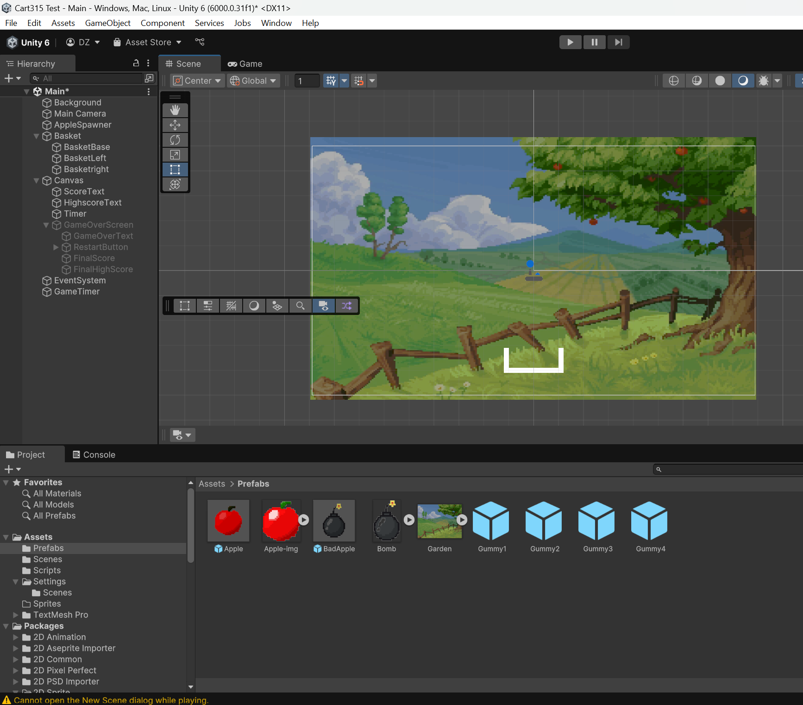
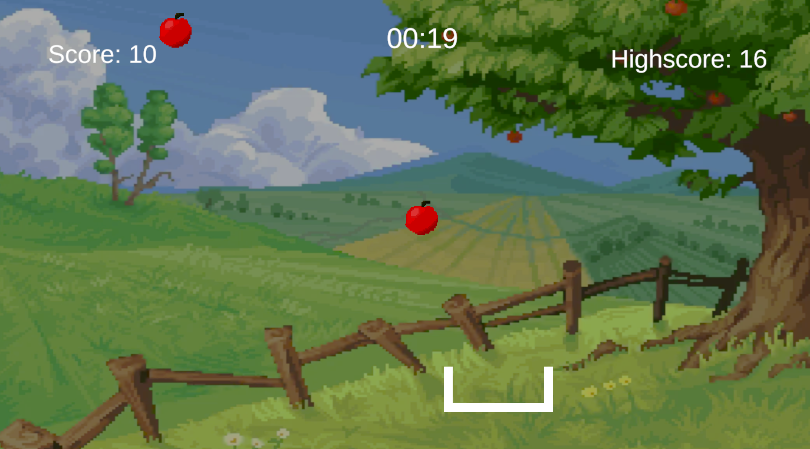
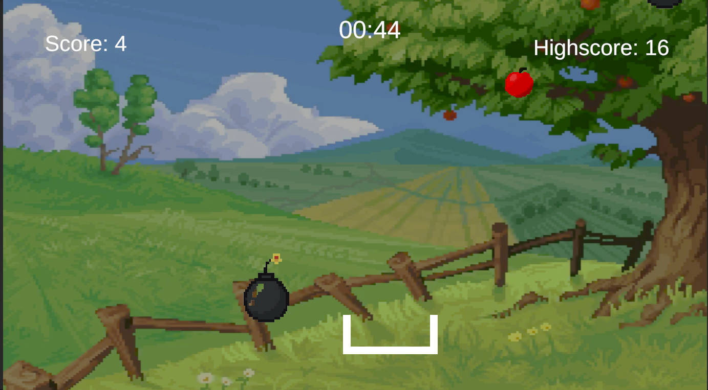
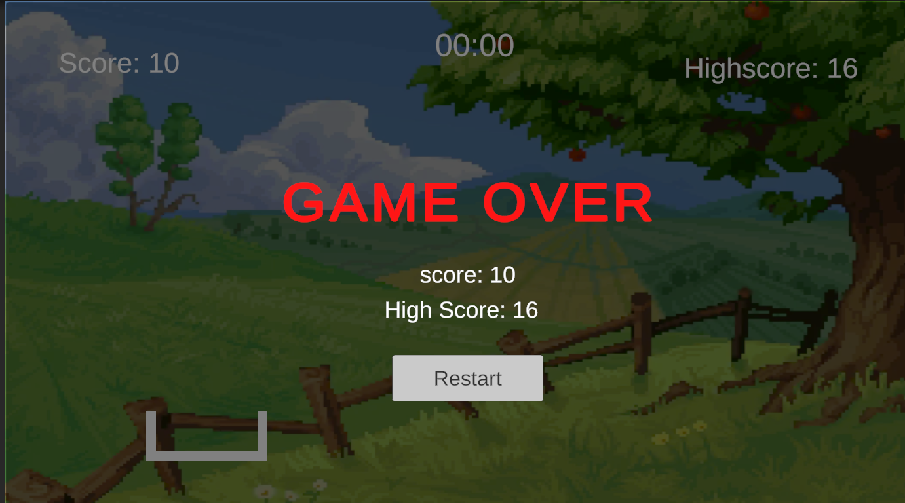

# Process Journal

## Exploration Prototype | 01.30.25

This week, I started working with the Unity test game we built in class, which includes a collector and a dropper that drops circles on the screen. Once the circles collide with the collector, they get destroyed. I spent some time brainstorming game ideas that could work with this mechanic and wouldn't be too complicated for me as a beginner to build. I watched a bunch of tutorials on YouTube to get inspiration and learn how to proceed with the game development process.

After a bit of thinking, I decided to make the game about apple picking. I began with the same project we started in class last week. Even though I eventually changed the names and scripts, I used that initial project as a foundation. The first thing I did was modify the shape of the collector and updated the control system. Instead of using the keyboard, I made it so the collector moves with the mouse input. I also changed the dropper to an apple spawner, and recreated the apple spawner script from scratch.

To add some depth to the game, I decided to introduce two types of apples: a good one that the player should collect and a bad one to avoid. I initially used basic circle shapes with different colors for these apples. But later, I created pixel art for the apples and added them as sprites to make it look better. I wanted to add an unexpected element to the game, so I decided to include a bomb as the "bad apple"—something people wouldn't expect to find at an apple picking garden, adding a funny twist to the gameplay.

Next, I added a script for a timer and score tracking. This part was a bit tricky because the tutorial I was following had a different Unity interface than the one I was using. At first, I used Unity's text component, but that caused some issues, so I switched to TextMeshPro. I also had to adjust my code to replace the Unity UI with TMPro at the top of my script and it worked in the end!

After that, I added a canvas for the end screen, where I could display the game over message, the score, and the highest score. I also included a restart button so the player could restart the game. Then, I made a few final tweaks to improve the look of the game, like changing some of the object designs and text to make everything more polished.

One of my favorite changes was updating the background. I replaced the empty background with an image of a garden, which I created as a sprite. At first, I couldn't see it, but then I figured out that I needed to change the camera background to transparent and adjust the image’s size and location. Once I did that, everything came together perfectly.

Overall, I had a great time working with Unity this week. I feel like making the prototype, and even rewriting similar scripts, really helped me understand how they work and what they do. For future projects, I’d love to incorporate my 3D art or create multi-layered background images to give the game more depth. I’m also excited to add sounds to make the experience more engaging.

There’s still a bit I’m unsure about, like how to submit a Unity game to GitHub or how others could play my Unity game without having Unity installed. I’m hoping to clarify this process and figure out the best way to organize and submit my projects, including my process journal. Overall, it’s been a productive and exciting week, and I’m looking forward to what comes next!

Game: [Apple Picking Game]()

### Below are the images of the my game: 

This is a photo of unity editor

This is a photo of Gameplay

This is another photo of Gameplay with the bombs falling.

This is a photo of Game over screen.

