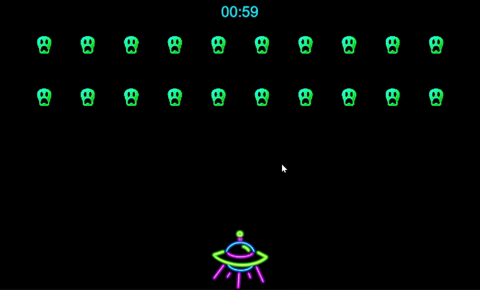
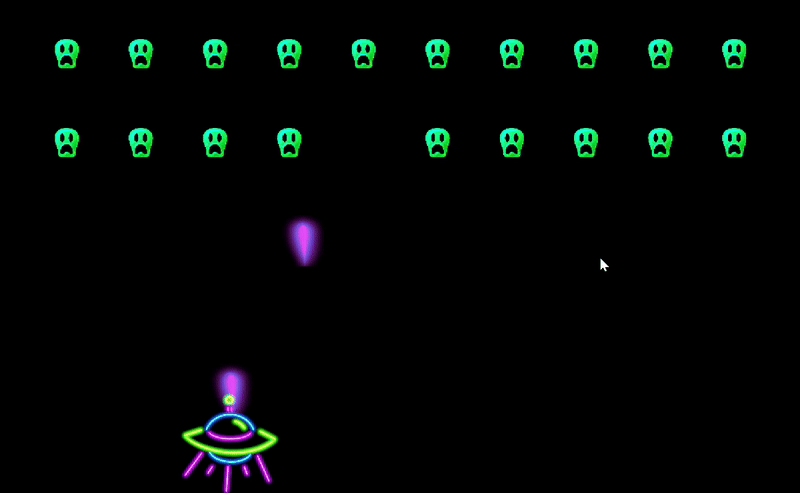
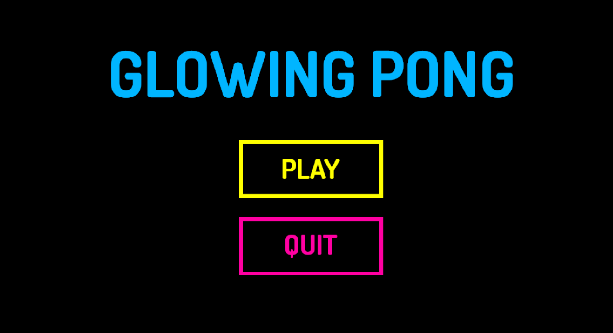
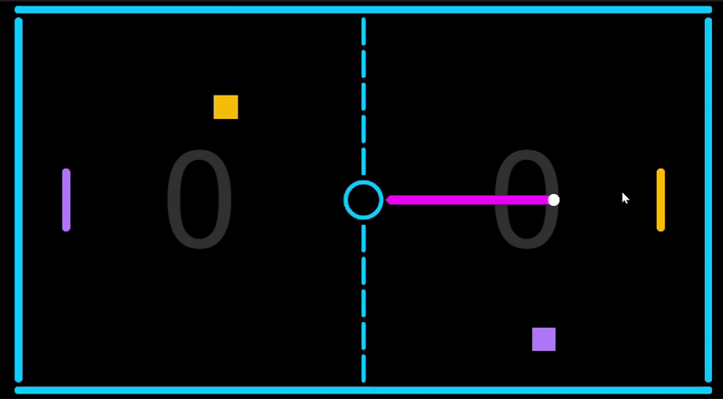
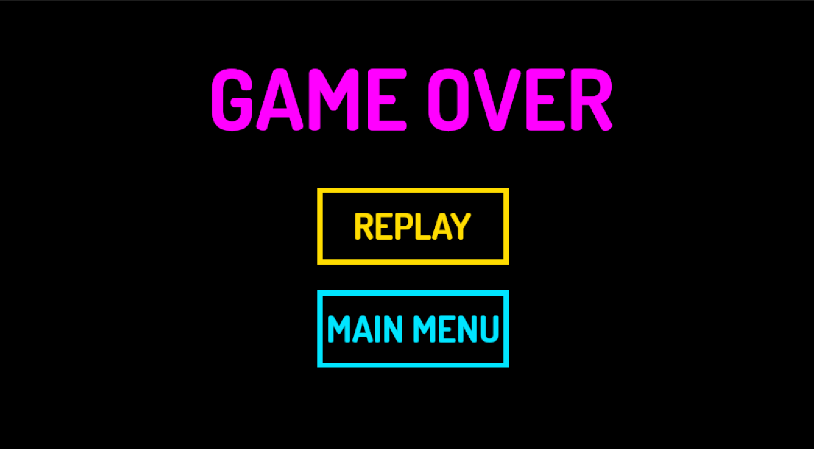
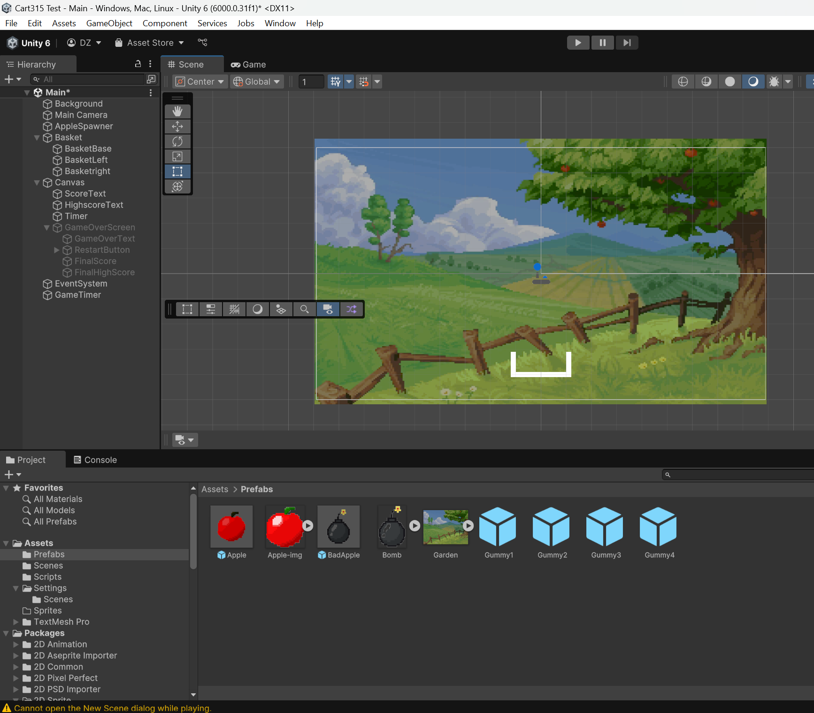
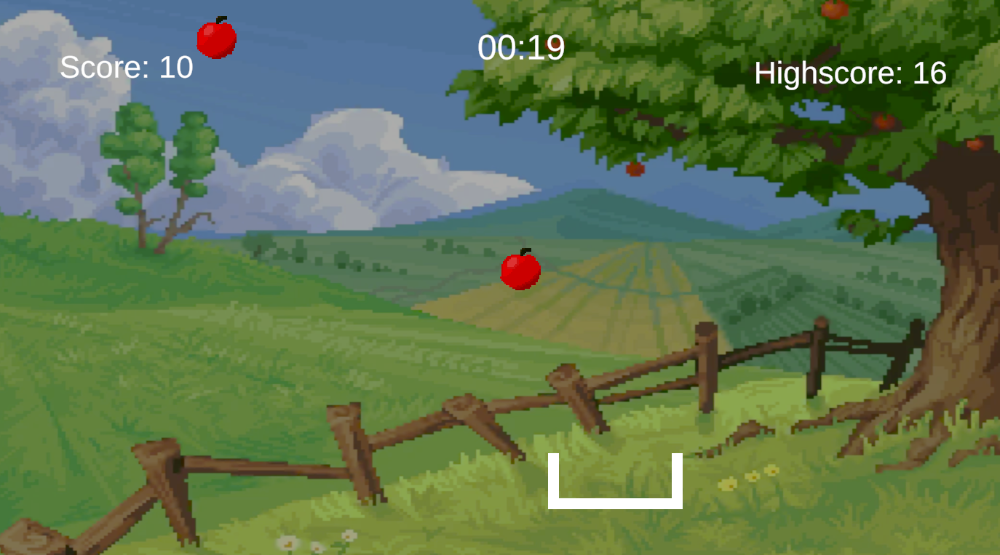
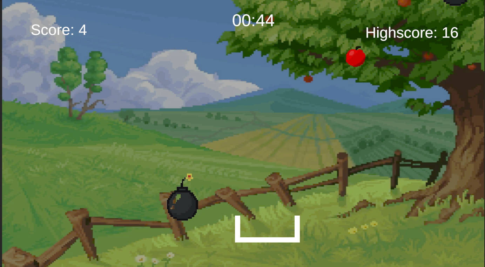
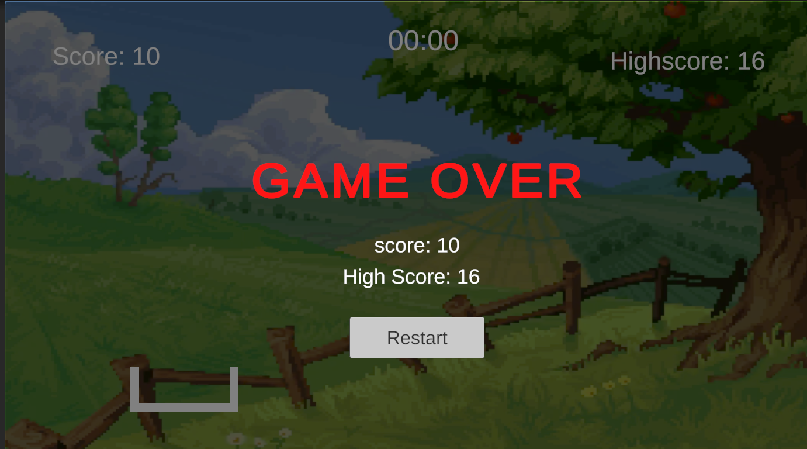

# Process Journal

## Alien Invasion Game 2 (Prototype 4) and game analysis| 02.18.25 

### **1. Alien Invasion Game journal:**

This week, I continued working on my Breakout-style game with an alien invasion theme.
I made several improvements to add more challenge and excitement to the gameplay.

**What I Worked On**
- Added falling stones:
    - Stones now spawn randomly from a random alien’s position.
    - They fall toward the spaceship, forcing the player to dodge while shooting aliens.
    - If a stone collides with the wall, it gets destroyed.
- Implemented a GameOver condition:
    - If a stone collides with the spaceship, the game ends.
- Implemented a win condition:
    - Added a countdown timer (60 seconds) displayed on the UI.
    - If the player destroys all aliens before the timer reaches 0 without getting hit by stones, they win.
    - Created a script to track how many aliens are left.
    - Displayed “Game Over” or “You Win!” text depending on the outcome.

**What I Learned**
I feel really happy with how this turned out, especially the falling stones animation (they drop like popcorn), making the game feel dynamic and fun. It was great to have two weeks to work on this game since I had the chance to continue working and build on what I already made and gave me more time to gather ideas and take more time to learn. Overall I think that it’s also a good balance of challenge and engagement.
I applied multiple things I learned from previous weeks: Random spawning, Object shooting mechanics, Breakout-style gameplay, and UI implementation.

**Next Steps (Ideas to Implement)**
- Power-ups (e.g., shield, extra life, faster shooting).
- Different types of aliens with unique abilities.

Game: [Alien Invasion Game](https://github.com/Dorsa-zare/CART315/tree/main/Projects/breakinOut)

This is a GIF of the game play.

### **2. Game Analysis: Level Devil:**

What Makes It Interesting:
The game constantly tricks you, platforms that seem stable disappear, and jumps behave weirdly. It keeps players on edge and forces them to stay alert. The controls are super simple, just running and jumping, but the way the game messes with physics makes it both fun and frustrating. It’s all about trial and error. You die a lot, but quick respawns make it feel more like a learning process than a punishment.

Where It Falls Short:
Some traps feel like pure guessing, which can get frustrating. Sometimes it feels less like skill and more like luck, which might turn some players off.

What I Can Use in Future Projects:
I like the idea of adding unexpected twists to gameplay, like power-ups with random effects. Also, designing levels that encourage players to experiment and learn by failing—but without making them rage-quit.

---------------------
## Breakout/Alien Invasion Game (Prototype 3)| 02.13.25
This week, as we worked on the Breakout game in class, I decided to build on that for my assignment. I started by thinking about the theme and the fun games I used to play as a kid that had similar mechanics. One of the first games that came to mind was Chicken Invaders which is a series of shoot 'em up games created by Greek indie developer Konstantinos Prouskas. It’s kind of like Space Invaders, but what I always loved about it was the aesthetic, the sound effects, and the way the chickens moved. Some would take multiple hits to defeat, and the challenge of dodging attacks while shooting made it really fun. So, I decided to take inspiration from that for my own game.

I started by replacing the original sprites to match a more neon, space-themed vibe. Instead of traditional bricks, I swapped them for alien faces that look like they’re screaming, which makes it both funny and a little chaotic. Then, instead of using the ball mechanic from Breakout, I changed it to a shooting mechanic. I added a bullet prefab and a script to make bullets spawn from the top of the spaceship (which was originally the paddle) whenever the player presses space. Once that was working, I made sure the bullets actually collided with the aliens and destroyed them on impact.

To add a bit of challenge, I made the aliens randomly change size, so sometimes they shrink to almost nothing and then suddenly grow back. This makes it harder to hit them and adds an unpredictable element to the game. At first, I thought making a shooting game would be really complicated, but once I got into it, it wasn’t as scary as I expected. It’s actually pretty similar to how we learned to spawn balls in our first game, where apples dropped from the top, it’s just even easier now because the bullets always spawn from a fixed point instead of randomly.

Right now, the game already looks fun, and I feel happy with how it’s turning out. But I definitely want to expand on it next week. My main goals are to make the aliens move around so they’re harder to hit, add sound effects to make the gameplay more satisfying, and create extra scenes like a main menu and a game over screen. That way, it’ll feel more like a complete game. For now, though, I’m satisfied with the progress, and I’m excited to keep working on it!

Game: [Alien Invasion Game](https://github.com/Dorsa-zare/CART315/tree/main/Projects/breakinOut)

This is a GIF of the game play.

---------------------
## My Pong Game (Prototype 2) | 02.05.25

This week, I decided to make the Pong game from scratch to test how much I remembered from class. I quickly realized I forgot a lot of the script details, so I had to follow a YouTube tutorial for the base of the game. Once I got that down, I created the basic Pong gameplay, added a main menu with options like Play and Exit, and then set up the main game and game over scenes. I also made sure to show the scores during the game, and if a player hits -7 points, it triggers the game over screen.

To make the game more immersive, I added background music and sound effects, which really brought everything to life. After getting the basics down, I wanted to add something unexpected and fun to the game. I thought about arcade ice hockey tables, where it’s frustrating when you’re slow and the puck is speeding toward you.
So, I decided to add items into the scene: a purple square for Player 1 (who has a purple racket) and a yellow square for Player 2 (whose racket is yellow). When either player hits the matching-colored square, their racket speed gets slowed down for a short time. The twist is that it takes 10 seconds for the racket speed to restore, adding a surprising and frustrating challenge when you can’t move fast enough to hit the ball.

Overall, I’m super satisfied with how it turned out! One challenge I ran into was adding a glowing trail to the ball and applying post-processing effects to make the scene glow. I managed to add the effect, but for some reason, it wasn’t glowing like I expected. It’s something I definitely want to dive deeper into and figure out in the upcoming days.

Game: [My Glowing Pong Game](https://github.com/Dorsa-zare/CART315/tree/main/Projects/MyPong)

This is a photo of the game's Menu.

This is a GIF of the game play.

This is a photo of the game's GameOver Screen. 

---------------------

## Exploration Prototype | 01.30.25

This week, I started working with the Unity test game we built in class, which includes a collector and a dropper that drops circles on the screen. Once the circles collide with the collector, they get destroyed. I spent some time brainstorming game ideas that could work with this mechanic and wouldn't be too complicated for me as a beginner to build. I watched a bunch of tutorials on YouTube to get inspiration and learn how to proceed with the game development process.

After a bit of thinking, I decided to make the game about apple picking. I began with the same project we started in class last week. Even though I eventually changed the names and scripts, I used that initial project as a foundation. The first thing I did was modify the shape of the collector and updated the control system. Instead of using the keyboard, I made it so the collector moves with the mouse input. I also changed the dropper to an apple spawner, and recreated the apple spawner script from scratch.

To add some depth to the game, I decided to introduce two types of apples: a good one that the player should collect and a bad one to avoid. I initially used basic circle shapes with different colors for these apples. But later, I created pixel art for the apples and added them as sprites to make it look better. I wanted to add an unexpected element to the game, so I decided to include a bomb as the "bad apple"—something people wouldn't expect to find at an apple picking garden, adding a funny twist to the gameplay.

Next, I added a script for a timer and score tracking. This part was a bit tricky because the tutorial I was following had a different Unity interface than the one I was using. At first, I used Unity's text component, but that caused some issues, so I switched to TextMeshPro. I also had to adjust my code to replace the Unity UI with TMPro at the top of my script and it worked in the end!

After that, I added a canvas for the end screen, where I could display the game over message, the score, and the highest score. I also included a restart button so the player could restart the game. Then, I made a few final tweaks to improve the look of the game, like changing some of the object designs and text to make everything more polished.

One of my favorite changes was updating the background. I replaced the empty background with an image of a garden, which I created as a sprite. At first, I couldn't see it, but then I figured out that I needed to change the camera background to transparent and adjust the image’s size and location. Once I did that, everything came together perfectly.

Overall, I had a great time working with Unity this week. I feel like making the prototype, and even rewriting similar scripts, really helped me understand how they work and what they do. For future projects, I’d love to incorporate my 3D art or create multi-layered background images to give the game more depth. I’m also excited to add sounds to make the experience more engaging.

There’s still a bit I’m unsure about, like how to submit a Unity game to GitHub or how others could play my Unity game without having Unity installed. I’m hoping to clarify this process and figure out the best way to organize and submit my projects, including my process journal. Overall, it’s been a productive and exciting week, and I’m looking forward to what comes next!

Game: [Apple Picking Game](https://github.com/Dorsa-zare/CART315/tree/main/Projects/Cart315%20Test)

### Below are the images of my game:

This is a photo of unity editor.

This is a photo of Gameplay.

This is another photo of Gameplay with the bombs falling.

This is a photo of Game over screen.

----------------------------------
## Tiny Game | 01.23.25

Since this was the first week of class, I went through the examples of other projects students made for the tiny games. I also checked the resources and different tools for making the tiny game. Some of the tools' interfaces were a bit more complicated to learn within a week; however, I enjoyed Bitsy. It has a simple interface that makes it easier to create pixel art, sprites, and transitions between rooms.

I decided to explore Bitsy and its features by looking at the games available on the website. After seeing the possibilities of this game engine, I brainstormed ideas for my game. First, I decided on the theme: the story of a cat lost in the woods, trying to find its human owner and get back home. A short, simple story that seemed like a good place to start.

I started by drawing the sprite and pixel art for the cat, human, trees, etc. I created Room 1 and added the tiles and the avatar that the player can control. To make it a bit more interesting and challenging, I thought about adding an item, fireflies, that the cat needs to collect in order to move to the next room. It worked, and then I wanted the next room to go completely dark unless the player had collected enough fireflies (a completely dark palette with only the cat visible).

This part was a bit challenging because Bitsy has limitations when it comes to carrying collected items into the next room. I decided to take a look at the code script, but it was really difficult since I wasn’t familiar with Bitsy’s scripting language. I tried writing some code, but the program crashed, and I lost my designs. So, I learned to save often and not mess with the script too much—instead, just using the interface as much as I can.

Finally, I created three rooms for the game, added dialogues and conditions, and designed the look and palette of each room. It takes about 2–3 minutes to play the game. I learned how to use Bitsy and make a pixel art game with a new tool, which was really helpful. It also helped me not overthink and just make something I enjoy, without feeling restricted by the tool or game mechanics.

The pressure of making a perfect game is gone, and I tried to enjoy the process instead of just focusing on the final result—even though I’m happy with how it turned out. For future games, I want to carry that mindset forward: learning and enjoying the process while also expanding my skills. I want to explore more tools like Unity, create my own 3D characters and environments, and keep experimenting with storytelling in my games.

Game: [Lost in the Woods Game](../Projects/lost_in_the_woods.html)

### Below are the images of the three rooms I have designed for my tiny game: 

This is a photo of room 0

This is a photo of room 1

This is a photo of room 2

