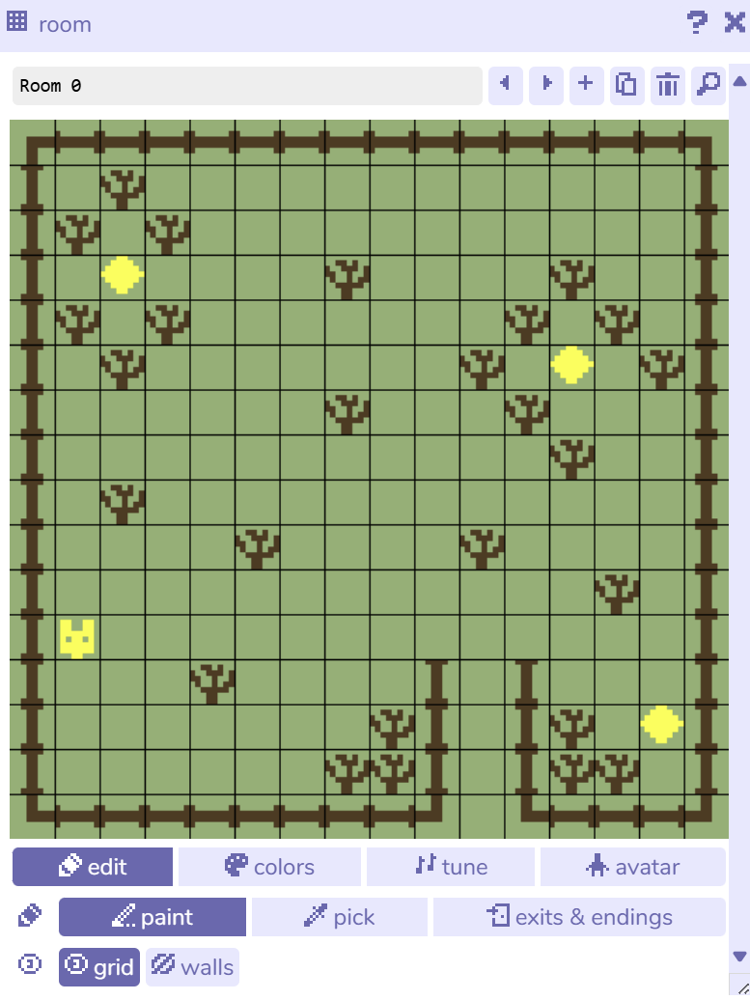
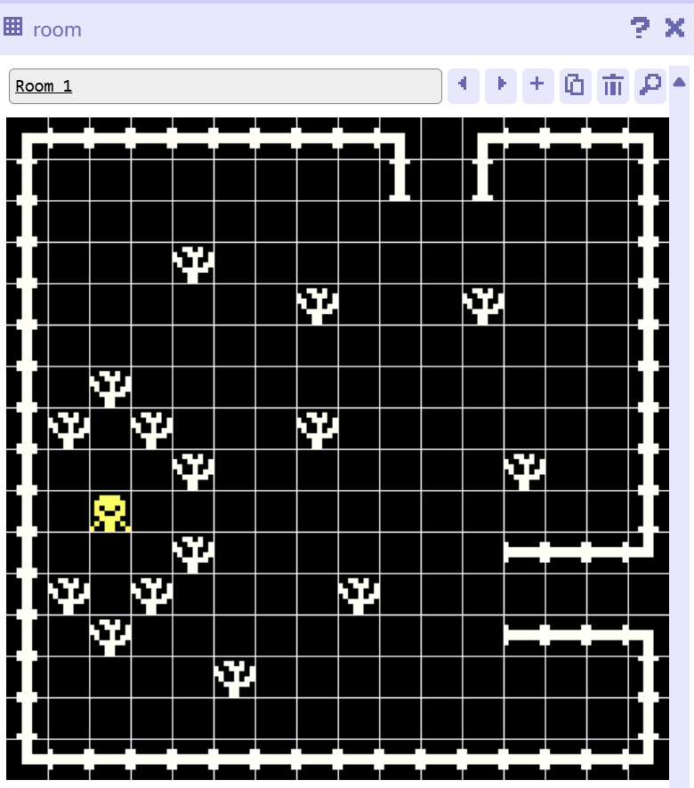
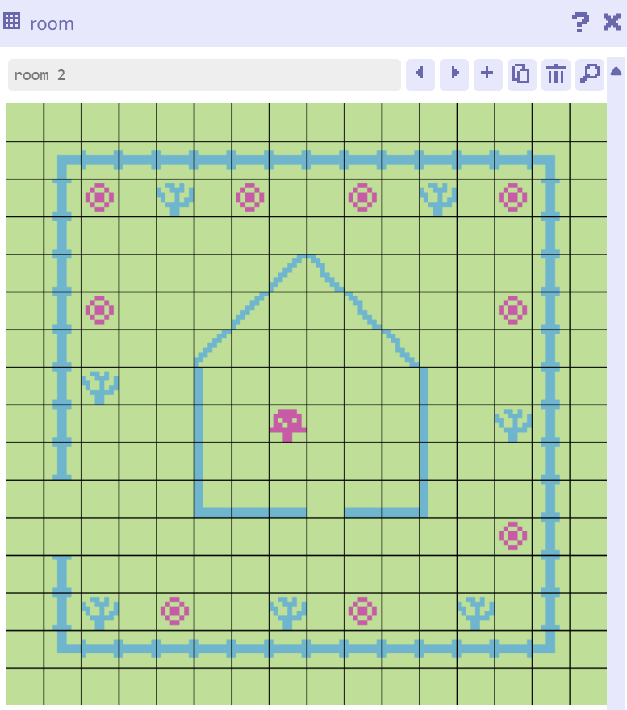

# Process Journal

## Tiny Game | 01.23.25

Since this was the first week of class, I went through the examples of other projects students made for the tiny games. I also checked the resources and different tools for making the tiny game. Some of the tools' interfaces were a bit more complicated to learn within a week; however, I enjoyed Bitsy. It has a simple interface that makes it easier to create pixel art, sprites, and transitions between rooms.

I decided to explore Bitsy and its features by looking at the games available on the website. After seeing the possibilities of this game engine, I brainstormed ideas for my game. First, I decided on the theme: the story of a cat lost in the woods, trying to find its human owner and get back home. A short, simple story that seemed like a good place to start.

I started by drawing the sprite and pixel art for the cat, human, trees, etc. I created Room 1 and added the tiles and the avatar that the player can control. To make it a bit more interesting and challenging, I thought about adding an item, fireflies, that the cat needs to collect in order to move to the next room. It worked, and then I wanted the next room to go completely dark unless the player had collected enough fireflies (a completely dark palette with only the cat visible).

This part was a bit challenging because Bitsy has limitations when it comes to carrying collected items into the next room. I decided to take a look at the code script, but it was really difficult since I wasn’t familiar with Bitsy’s scripting language. I tried writing some code, but the program crashed, and I lost my designs. So, I learned to save often and not mess with the script too much—instead, just using the interface as much as I can.

Finally, I created three rooms for the game, added dialogues and conditions, and designed the look and palette of each room. It takes about 2–3 minutes to play the game. I learned how to use Bitsy and make a pixel art game with a new tool, which was really helpful. It also helped me not overthink and just make something I enjoy, without feeling restricted by the tool or game mechanics.

The pressure of making a perfect game is gone, and I tried to enjoy the process instead of just focusing on the final result—even though I’m happy with how it turned out. For future games, I want to carry that mindset forward: learning and enjoying the process while also expanding my skills. I want to explore more tools like Unity, create my own 3D characters and environments, and keep experimenting with storytelling in my games.

Game: [Lost in the Woods Game](Projects/lost_in_the_woods.html)

### Below are the images of the three rooms I have designed for my tiny game: 

This is a photo of room 0

This is a photo of room 1

This is a photo of room 2

